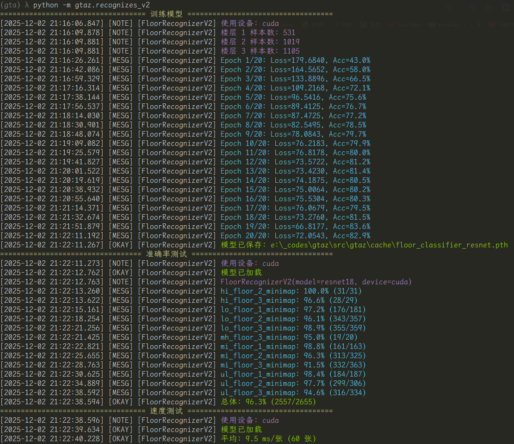
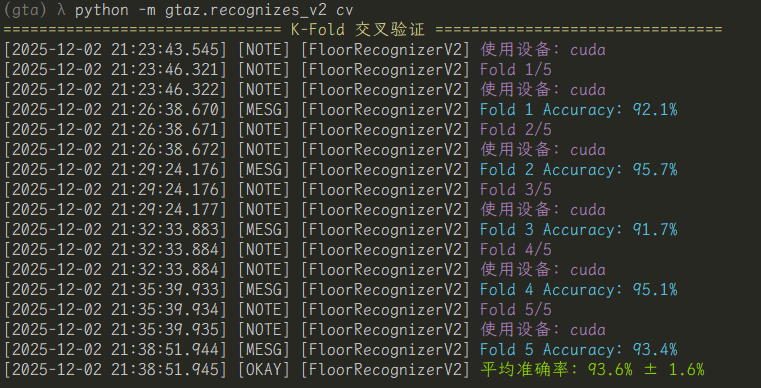

# GTAZ
Visual-based AI for real-time tasks in GTAV.


## Thanks to

Many codes (especially `GamepadSimulator` ) are inspired by and inherited from:

- [shibeta/JNTMbot_python](https://github.com/shibeta/JNTMbot_python)

Without the original author's great work, this project would not be possible.

## Install package

```sh
pip install gtaz --upgrade
```

## Screenshots

根据小地图，识别角色在事务所的楼层。训练日志：



交叉验证：



## How to use

TBD